# Chapter 1: First Insights

## First_Insights.py
```shell
/home/cwm/git/git.c-w-m/nlp_dev/src/btap/.tox/btap38/bin/python /home/cwm/git/git.c-w-m/nlp_dev/src/btap/ch01/First_Insights.py
Chapter 01: First Insights
~~~~~~~~~~~~~~~~~~~~~~~~~~~~~~~~~~~~~~~~~~~~~~~~
setup.py


~~~~~~~~~~~~~~~~~~~~~~~~~~~~~~~~~~~~~~~~~~~~~~~~
settings.py


~~~~~~~~~~~~~~~~~~~~~~~~~~~~~~~~~~~~~~~~~~~~~~~~
What you will learn and what we will build
Exploratory Data Analysis
Introducing the Dataset
      session  year country    country_name  \
3871       51  1996     PER            Peru   
4697       56  2001     GBR  United Kingdom   

                                    speaker                      position  \
3871  Francisco Tudela Van Breughel Douglas  Minister for Foreign Affairs   
4697                             Jack Straw  Minister for Foreign Affairs   

                                                                                                                                                       text  
3871  At the outset, allow me,\nSir, to convey to you and to this Assembly the greetings\nand congratulations of the Peruvian people, as well as\ntheir...  
4697  Please allow me\nwarmly to congratulate you, Sir, on your assumption of\nthe presidency of the fifty-sixth session of the General\nAssembly.\nThi...  


~~~~~~~~~~~~~~~~~~~~~~~~~~~~~~~~~~~~~~~~~~~~~~~~
Blueprint: Getting an Overview of the Data with Pandas
          count     mean     std     min      25%      50%      75%      max
session 7507.00    49.61   12.89   25.00    39.00    51.00    61.00    70.00
year    7507.00  1994.61   12.89 1970.00  1984.00  1996.00  2006.00  2015.00
length  7507.00 17967.28 7860.04 2362.00 12077.00 16424.00 22479.50 72041.00
        count unique            top freq
country  7507    199            PER   46
speaker  7480   5428  Seyoum Mesfin   12


~~~~~~~~~~~~~~~~~~~~~~~~~~~~~~~~~~~~~~~~~~~~~~~~
Checking for Missing Data
session            0
year               0
country            0
country_name       0
speaker           27
position        3005
text               0
length             0
dtype: int64
George W. Bush        4
Mr. George W. Bush    2
George Bush           1
Mr. George W Bush     1
Bush                  1
Name: speaker, dtype: int64


~~~~~~~~~~~~~~~~~~~~~~~~~~~~~~~~~~~~~~~~~~~~~~~~
Plotting Value Distributions

ch01_fig01_value_distribution_box.png
```

```shell
ch01_fig02_value_distribution_histo.png
```
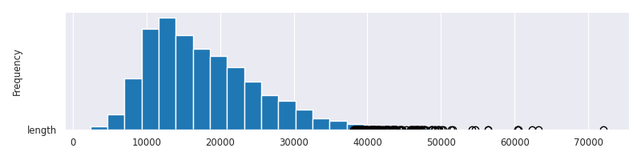
```shell
ch01_fig03_value_distribution_histo.png
```
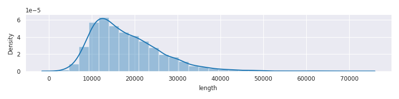

```shell
~~~~~~~~~~~~~~~~~~~~~~~~~~~~~~~~~~~~~~~~~~~~~~~~
Comparing Value Distributions across Categories

ch01_fig04_country_value_distribution_box.png
```
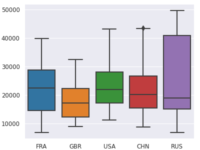
```shell

ch01_fig05_country_value_distribution_violin.png
```
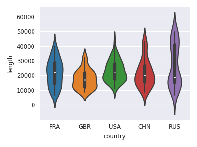

```shell
~~~~~~~~~~~~~~~~~~~~~~~~~~~~~~~~~~~~~~~~~~~~~~~~
Visualizing Developments over Time

ch01_fig06_development_time_line.png
```
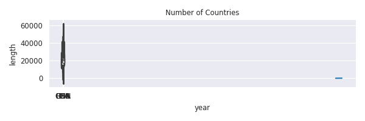
```shell

ch01_fig07_speech_length_time_line.png
```
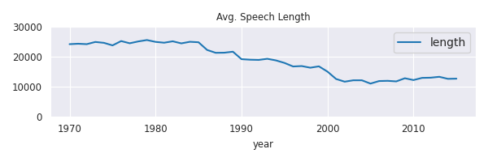

```shell
~~~~~~~~~~~~~~~~~~~~~~~~~~~~~~~~~~~~~~~~~~~~~~~~
Blueprint: Building a Simple Text Preprocessing Pipeline
Tokenization with Regular Expressions
Let|s|defeat|SARS-CoV-2|together|in


~~~~~~~~~~~~~~~~~~~~~~~~~~~~~~~~~~~~~~~~~~~~~~~~
Treating Stop Words
[nltk_data] Downloading package stopwords to /home/cwm/nltk_data...
[nltk_data]   Package stopwords is already up-to-date!
  0%|          | 0/7507 [00:00<?, ?it/s]

~~~~~~~~~~~~~~~~~~~~~~~~~~~~~~~~~~~~~~~~~~~~~~~~
Processing a Pipeline with one Line of Code
100%|██████████| 7507/7507 [00:28<00:00, 262.71it/s]
100%|██████████| 7507/7507 [00:00<00:00, 515616.55it/s]


~~~~~~~~~~~~~~~~~~~~~~~~~~~~~~~~~~~~~~~~~~~~~~~~
Blueprints for Word Frequency Analysis
Blueprint: Counting Words with a Counter
Counter({'my': 3, 'cats': 2, 'She': 1, 'likes': 1, 'and': 1, 'like': 1, 'sofa': 1})
Counter({'my': 3, 'cats': 3, 'She': 2, 'likes': 2, 'and': 2, 'like': 1, 'sofa': 1, 'dogs': 1})
  0%|          | 0/7507 [00:00<?, ?it/s][('nations', 124508),
 ('united', 120763),
 ('international', 117223),
 ('world', 89421),
 ('countries', 85734)]
100%|██████████| 7507/7507 [00:02<00:00, 2998.14it/s]
100%|██████████| 7507/7507 [00:14<00:00, 506.33it/s]


~~~~~~~~~~~~~~~~~~~~~~~~~~~~~~~~~~~~~~~~~~~~~~~~
Blueprint: Creating a Frequency Diagram

ch01_fig08_top_word_freq.png
```
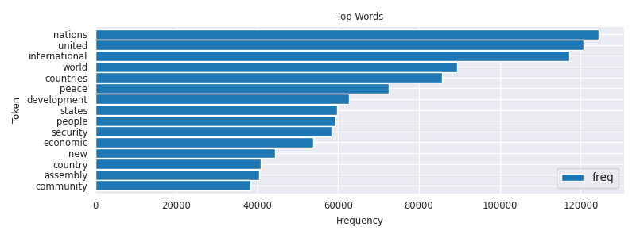

```shell

~~~~~~~~~~~~~~~~~~~~~~~~~~~~~~~~~~~~~~~~~~~~~~~~
Blueprint: Creating Word Clouds
100%|██████████| 193/193 [00:00<00:00, 5746.44it/s]
  0%|          | 0/7507 [00:00<?, ?it/s]

ch01_fig09_2015_max100_wc_raw.png
```

```shell

ch01_fig10_2015_max100_raw_vs_rm_stopwords50.png
```
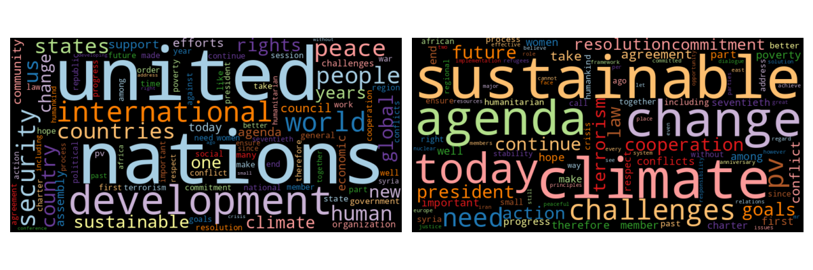

```shell

ch01_fig11_1970-2015_TF_vs_TF-IDF.png
```


```shell
~~~~~~~~~~~~~~~~~~~~~~~~~~~~~~~~~~~~~~~~~~~~~~~~
Blueprint: Ranking with TF-IDF
100%|██████████| 7507/7507 [00:02<00:00, 3057.93it/s]
              df  idf
token                
nal            2 8.33
corporation   39 5.36
lilliputian    3 7.92
ill-gotten    20 6.03
denial       582 2.66
100%|██████████| 70/70 [00:00<00:00, 3070.73it/s]
100%|██████████| 193/193 [00:00<00:00, 5761.73it/s]

ch01_fig12_all_vs_climate_bigram_wc.png
```
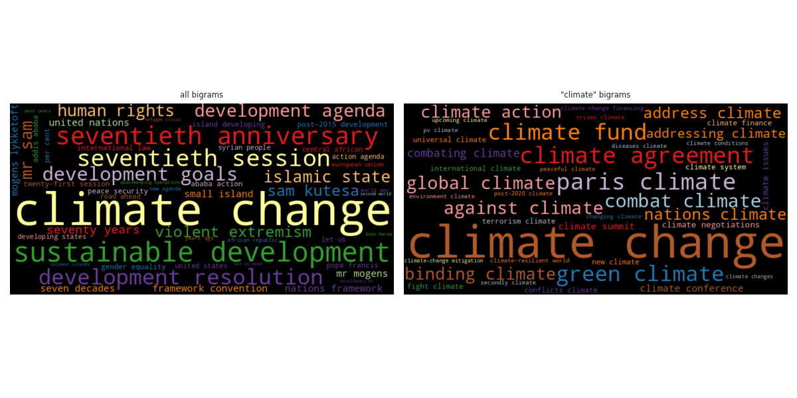

```shell
~~~~~~~~~~~~~~~~~~~~~~~~~~~~~~~~~~~~~~~~~~~~~~~~
Blueprint: Finding a Keyword in Context (KWIC)
100%|██████████| 193/193 [00:00<00:00, 2771.50it/s]
  0%|          | 0/7507 [00:00<?, ?it/s]5 random samples out of 73 contexts for 'sdgs':
 of our planet and its people. The   SDGs   are a tangible manifestation of th
nd, we are expected to achieve the   SDGs   and to demonstrate dramatic develo
ead by example in implementing the   SDGs   in Bangladesh. Attaching due impor
the Sustainable Development Goals (  SDGs  ). We applaud all the Chairs of the
new Sustainable Development Goals (  SDGs  ) aspire to that same vision. The A


~~~~~~~~~~~~~~~~~~~~~~~~~~~~~~~~~~~~~~~~~~~~~~~~
Blueprint: Analyzing N-Grams
the visible|visible manifestation|manifestation of|of the|the global|global climate|climate change
Bigrams: visible manifestation|global climate|climate change
Trigrams: global climate change
100%|██████████| 7507/7507 [00:22<00:00, 339.12it/s]
100%|██████████| 7507/7507 [00:16<00:00, 458.87it/s]
100%|██████████| 7507/7507 [00:01<00:00, 4074.99it/s]
                           freq
token                          
united nations           103236
international community   27786
general assembly          27096
security council          20961
human rights              19856
100%|██████████| 7507/7507 [00:02<00:00, 3083.45it/s]
100%|██████████| 7507/7507 [00:01<00:00, 3884.30it/s]
100%|██████████| 193/193 [00:00<00:00, 11663.94it/s]
                         freq  tfidf
token                               
united nations           2255 236.04
sustainable development   580 743.59
human rights              574 287.35
climate change            532 877.25
international community   459 111.73
...                       ...    ...
landmark achievement        2    NaN
changing realities          2  10.88
necessary financial         2   9.26
somalia amisom              2  12.06
without distinction         2   7.96

[7893 rows x 2 columns]

ch01_fig13_top5_freq_timeline_line.png
```
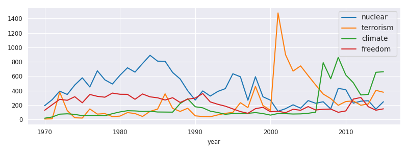

```shell
~~~~~~~~~~~~~~~~~~~~~~~~~~~~~~~~~~~~~~~~~~~~~~~~
Blueprint: Comparing Frequencies across Time-Intervals and Categories
Creating Frequency Timelines
[1, 0, 3, 2]
100%|██████████| 7507/7507 [00:01<00:00, 5490.38it/s]
      nuclear  terrorism  climate  freedom
year                                      
1970      192          7       18      128
1971      275          9       35      205
1972      393        379       74      280
1973      347        124       79      266
1974      478         24       71      316
1975      578         20       53      232
1976      451        146       57      347
1977      675         75       58      321
1978      550         82       52      309
1979      492         40       81      366
1980      613         47      105      350
1981      717         96      122      349
1982      657         83      119      280
1983      776         42      112      354
1984      890        113      115      314
1985      809        144      104      301
1986      807        356      103      270
1987      652        154      102      302
1988      562        112      222      236
1989      399        156      287      282
1990      269         51      177      297
1991      396         41      162      360
1992      325         38      116      244
1993      389         64       97      211
1994      428         85       72      185
1995      634         99       83      147
1996      593        233       85      110
1997      267        165       85       86
1998      593        459       96      150
1999      315        194       82      169
2000      268        127       61      107
2001      114       1477       83      115
2002      150        898       81       94
2003      204        671       76      142
2004      157        743       78      128
2005      262        609       86      179
2006      225        479      102      132
2007      246        353      788      142
2008      147        290      565      145
2009      431        197      861      100
2010      414        249      618      119
2011      227        257      510      283
2012      254        198      340      305
2013      260        216      349      177
2014      144        404      654      129
2015      246        378      662      148
100%|██████████| 1245/1245 [00:00<00:00, 2242.48it/s]
5 random samples out of 581 contexts for 'climate':
ation with a view to replacing the   climate   of fear, mistrust and hatred by to
ntributing to the maintenance of a   climate   of peace, harmony and understandin
ges in the international political   climate  . There is increasing awareness of 
rian-Israeli front, have created a   climate   which favors the continuation of n
 that, far from noting a promising   climate   in the most critical areas of inte
None


~~~~~~~~~~~~~~~~~~~~~~~~~~~~~~~~~~~~~~~~~~~~~~~~
Creating Frequency Heat Maps
100%|██████████| 7507/7507 [00:03<00:00, 1936.57it/s]

ch01_fig14_keyword_timeline_heatmap.png
```
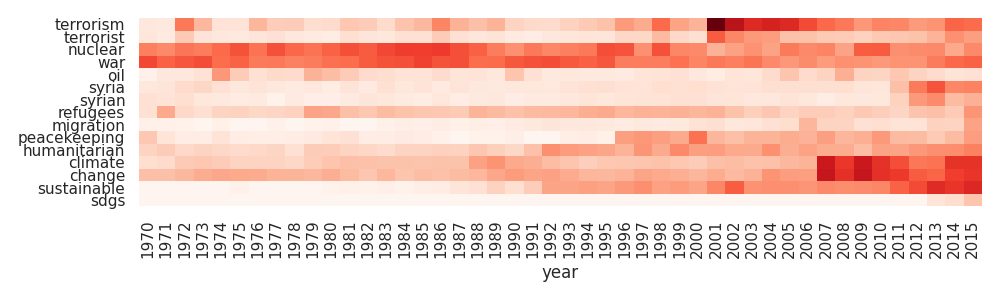

```shell
~~~~~~~~~~~~~~~~~~~~~~~~~~~~~~~~~~~~~~~~~~~~~~~~

Process finished with exit code 0

```