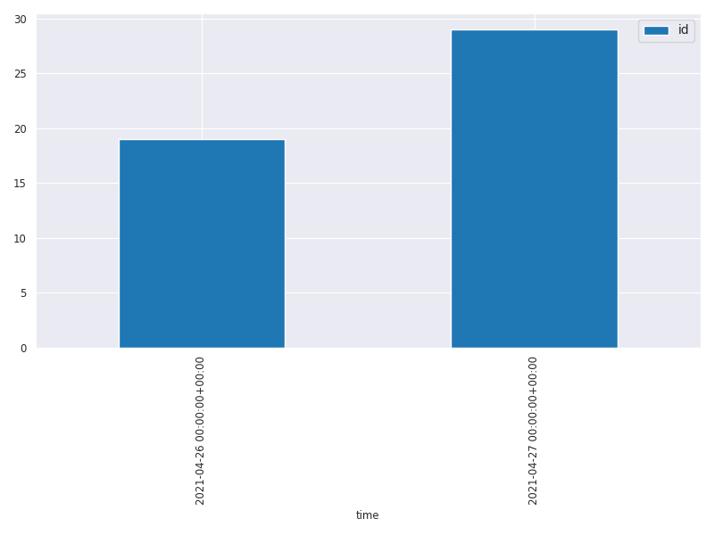

# Chapter 3: Scraping Extraction

## Scraping_Extraction.py
```shell
/home/cwm/git/git.c-w-m/nlp_dev/src/btap/.tox/btap38/bin/python /home/cwm/git/git.c-w-m/nlp_dev/src/btap/ch03/Scraping_Extraction.py
Chapter 03: Scraping Extraction
~~~~~~~~~~~~~~~~~~~~~~~~~~~~~~~~~~~~~~~~~~~~~~~~
setup.py


~~~~~~~~~~~~~~~~~~~~~~~~~~~~~~~~~~~~~~~~~~~~~~~~
settings.py


~~~~~~~~~~~~~~~~~~~~~~~~~~~~~~~~~~~~~~~~~~~~~~~~
Blueprint: download and interpret robots.txt


~~~~~~~~~~~~~~~~~~~~~~~~~~~~~~~~~~~~~~~~~~~~~~~~
Blueprint: finding URLs from sitemap.xml
https://www.reuters.com/article/us-space-exploration-blue-origin-nasa/musk-trolls-bezos-as-space-race-between-worlds-richest-men-heats-up-idUSKBN2CD2TI
https://www.reuters.com/article/us-oil-opec-meeting/opec-sticks-to-plan-to-ease-oil-output-cuts-from-may-1-sources-say-idUSKBN2CE0T6
https://www.reuters.com/article/oil-opec-meeting-int/opec-sticks-to-plan-to-ease-oil-output-cuts-from-may-1-sources-say-idUSKBN2CE0U2


~~~~~~~~~~~~~~~~~~~~~~~~~~~~~~~~~~~~~~~~~~~~~~~~
Blueprint: finding URLs from RSS
[('Mexico City to begin gradual exit from lockdown on Monday', 'http://feeds.reuters.com/~r/Reuters/worldNews/~3/OQtkVdAqHos/mexico-city-to-begin-gradual-exit-from-lockdown-on-monday-idUSKBN23K00R'), ('Mexico reports record tally of 5,222 new coronavirus cases', 'http://feeds.reuters.com/~r/Reuters/worldNews/~3/Rkz9j2G7lJU/mexico-reports-record-tally-of-5222-new-coronavirus-cases-idUSKBN23K00B'), ('Venezuela supreme court to swear in new electoral council leaders, government says', 'http://feeds.reuters.com/~r/Reuters/worldNews/~3/cc3R5aq4Ksk/venezuela-supreme-court-to-swear-in-new-electoral-council-leaders-government-says-idUSKBN23J39T'), ("One-fifth of Britain's coronavirus patients were infected in hospitals: Telegraph", 'http://feeds.reuters.com/~r/Reuters/worldNews/~3/1_7Wb0S_6-8/one-fifth-of-britains-coronavirus-patients-were-infected-in-hospitals-telegraph-idUSKBN23J382'), ('France to lift border controls for EU travellers on June 15', 'http://feeds.reuters.com/~r/Reuters/worldNews/~3/59BfrIYmz5w/france-to-lift-border-controls-for-eu-travellers-on-june-15-idUSKBN23J385'), ("Brazil's COVID-19 deaths surge past UK, WHO says hospital system coping", 'http://feeds.reuters.com/~r/Reuters/worldNews/~3/SVdaoPH85n4/brazils-covid-19-deaths-surge-past-uk-who-says-hospital-system-coping-idUSKBN23J30F'), ("Canada's Trudeau calls arrest video of indigenous leader 'shocking'", 'http://feeds.reuters.com/~r/Reuters/worldNews/~3/I7SImHlpjnM/canadas-trudeau-calls-arrest-video-of-indigenous-leader-shocking-idUSKBN23J2YF'), ('Egypt registers highest daily rise in coronavirus cases in nearly two weeks', 'http://feeds.reuters.com/~r/Reuters/worldNews/~3/EYyoma3WpSU/egypt-registers-highest-daily-rise-in-coronavirus-cases-in-nearly-two-weeks-idUSKBN23J36C'), ('Artists around the world pay tribute to George Floyd', 'http://feeds.reuters.com/~r/Reuters/worldNews/~3/r1LKkd3sJbs/artists-around-the-world-pay-tribute-to-george-floyd-idUSKBN23J35M'), ("Brazil's COVID-19 death toll passes Britain, world's second highest", 'http://feeds.reuters.com/~r/Reuters/worldNews/~3/g_uEz1XDgII/brazils-covid-19-death-toll-passes-britain-worlds-second-highest-idUSKBN23J35Q'), ('Lebanon protesters burn roads, clash with security in second night of unrest', 'http://feeds.reuters.com/~r/Reuters/worldNews/~3/nlJrlQbdQaw/lebanon-protesters-burn-roads-clash-with-security-in-second-night-of-unrest-idUSKBN23J33Z'), ("'Stop buying social peace at our expense', French police tell government", 'http://feeds.reuters.com/~r/Reuters/worldNews/~3/ZXOifRQXcjc/stop-buying-social-peace-at-our-expense-french-police-tell-government-idUSKBN23J17H'), ('Soccer team mobs coffin of murdered Mexican teen after moving tribute', 'http://feeds.reuters.com/~r/Reuters/worldNews/~3/KlaKFzEWF5s/soccer-team-mobs-coffin-of-murdered-mexican-teen-after-moving-tribute-idUSKBN23J33O'), ("Chile's military moves through shadows to spot coronavirus curfew breakers", 'http://feeds.reuters.com/~r/Reuters/worldNews/~3/kWg9jn4jS18/chiles-military-moves-through-shadows-to-spot-coronavirus-curfew-breakers-idUSKBN23J33D'), ("Somalia's Islamist group al Shabaab says sets up COVID-19 treatment centre", 'http://feeds.reuters.com/~r/Reuters/worldNews/~3/1AzaAZSLi50/somalias-islamist-group-al-shabaab-says-sets-up-covid-19-treatment-centre-idUSKBN23J32C'), ("Congo's gold being smuggled out by the tonne, U.N. report finds", 'http://feeds.reuters.com/~r/Reuters/worldNews/~3/0h7HNifS-EA/congos-gold-being-smuggled-out-by-the-tonne-u-n-report-finds-idUSKBN23J324'), ('Brazil drops police from human rights report amid global protests against racism and abuse', 'http://feeds.reuters.com/~r/Reuters/worldNews/~3/keFB_DL2_3Q/brazil-drops-police-from-human-rights-report-amid-global-protests-against-racism-and-abuse-idUSKBN23J316'), ('Slovenia to open borders for Italians, Montenegrins on June 15', 'http://feeds.reuters.com/~r/Reuters/worldNews/~3/Lp-FVxxomp8/slovenia-to-open-borders-for-italians-montenegrins-on-june-15-idUSKBN23J31U'), ('Botswana reinstates strict coronavirus lockdown in capital city', 'http://feeds.reuters.com/~r/Reuters/worldNews/~3/alBNYMaCpxA/botswana-reinstates-strict-coronavirus-lockdown-in-capital-city-idUSKBN23J31Q'), ('Coronavirus hitting the Americas hardest says World Health Organization', 'http://feeds.reuters.com/~r/Reuters/worldNews/~3/nOWjc9tZhig/coronavirus-hitting-the-americas-hardest-says-world-health-organization-idUSKBN23J2K3')]
['https://www.reuters.com/article/us-health-coronavirus-mexico-city/mexico-city-to-begin-gradual-exit-from-lockdown-on-monday-idUSKBN23K00R?feedType=RSS&feedName=worldNews', 'https://www.reuters.com/article/us-health-coronavirus-mexico/mexico-reports-record-tally-of-5222-new-coronavirus-cases-idUSKBN23K00B?feedType=RSS&feedName=worldNews', 'https://www.reuters.com/article/us-venezuela-politics/venezuela-supreme-court-to-swear-in-new-electoral-council-leaders-government-says-idUSKBN23J39T?feedType=RSS&feedName=worldNews', 'https://www.reuters.com/article/us-health-coronavirus-britain-hospitals/one-fifth-of-britains-coronavirus-patients-were-infected-in-hospitals-telegraph-idUSKBN23J382?feedType=RSS&feedName=worldNews', 'https://www.reuters.com/article/us-health-coronavirus-france-borders/france-to-lift-border-controls-for-eu-travellers-on-june-15-idUSKBN23J385?feedType=RSS&feedName=worldNews', 'https://www.reuters.com/article/us-health-coronavirus-brazil/brazils-covid-19-deaths-surge-past-uk-who-says-hospital-system-coping-idUSKBN23J30F?feedType=RSS&feedName=worldNews', 'https://www.reuters.com/article/us-canada-police-trudeau/canadas-trudeau-calls-arrest-video-of-indigenous-leader-shocking-idUSKBN23J2YF?feedType=RSS&feedName=worldNews', 'https://www.reuters.com/article/us-health-coronavirus-egypt-toll/egypt-registers-highest-daily-rise-in-coronavirus-cases-in-nearly-two-weeks-idUSKBN23J36C?feedType=RSS&feedName=worldNews', 'https://www.reuters.com/article/us-minneapolis-police-protests-art/artists-around-the-world-pay-tribute-to-george-floyd-idUSKBN23J35M?feedType=RSS&feedName=worldNews', 'https://www.reuters.com/article/us-health-coronavirus-brazil-numbers/brazils-covid-19-death-toll-passes-britain-worlds-second-highest-idUSKBN23J35Q?feedType=RSS&feedName=worldNews', 'https://www.reuters.com/article/us-lebanon-crisis-protests/lebanon-protesters-burn-roads-clash-with-security-in-second-night-of-unrest-idUSKBN23J33Z?feedType=RSS&feedName=worldNews', 'https://www.reuters.com/article/us-france-security-police/stop-buying-social-peace-at-our-expense-french-police-tell-government-idUSKBN23J17H?feedType=RSS&feedName=worldNews', 'https://www.reuters.com/article/us-minneapolis-police-mexico/soccer-team-mobs-coffin-of-murdered-mexican-teen-after-moving-tribute-idUSKBN23J33O?feedType=RSS&feedName=worldNews', 'https://www.reuters.com/article/us-health-coronavirus-chile-army/chiles-military-moves-through-shadows-to-spot-coronavirus-curfew-breakers-idUSKBN23J33D?feedType=RSS&feedName=worldNews', 'https://www.reuters.com/article/us-health-coronavirus-somalia/somalias-islamist-group-al-shabaab-says-sets-up-covid-19-treatment-centre-idUSKBN23J32C?feedType=RSS&feedName=worldNews', 'https://www.reuters.com/article/us-congo-gold/congos-gold-being-smuggled-out-by-the-tonne-u-n-report-finds-idUSKBN23J324?feedType=RSS&feedName=worldNews', 'https://www.reuters.com/article/us-brazil-violence/brazil-drops-police-from-human-rights-report-amid-global-protests-against-racism-and-abuse-idUSKBN23J316?feedType=RSS&feedName=worldNews', 'https://www.reuters.com/article/us-health-coronavirus-slovenia-italy/slovenia-to-open-borders-for-italians-montenegrins-on-june-15-idUSKBN23J31U?feedType=RSS&feedName=worldNews', 'https://www.reuters.com/article/us-health-coronavirus-botswana/botswana-reinstates-strict-coronavirus-lockdown-in-capital-city-idUSKBN23J31Q?feedType=RSS&feedName=worldNews', 'https://www.reuters.com/article/us-health-coronavirus-who/coronavirus-hitting-the-americas-hardest-says-world-health-organization-idUSKBN23J2K3?feedType=RSS&feedName=worldNews']


~~~~~~~~~~~~~~~~~~~~~~~~~~~~~~~~~~~~~~~~~~~~~~~~
Example: Downloading HTML pages with Python
start stopwatch
end stopwatch
elapsed time: 2.292 seconds


~~~~~~~~~~~~~~~~~~~~~~~~~~~~~~~~~~~~~~~~~~~~~~~~
Blueprint: Extraction with regular expressions
Banned in Boston: Without vaping, medical marijuana patients must adapt | Reuters


~~~~~~~~~~~~~~~~~~~~~~~~~~~~~~~~~~~~~~~~~~~~~~~~
Using an HTML parser for extraction
[<h1 class="ArticleHeader_headline">Banned in Boston: Without vaping, medical marijuana patients must adapt</h1>]


~~~~~~~~~~~~~~~~~~~~~~~~~~~~~~~~~~~~~~~~~~~~~~~~
Blueprint: extracting the title/headline
<h1 class="ArticleHeader_headline">Banned in Boston: Without vaping, medical marijuana patients must adapt</h1>
Banned in Boston: Without vaping, medical marijuana patients must adapt

                Banned in Boston: Without vaping, medical marijuana patients must adapt - Reuters
Banned in Boston: Without vaping, medical marijuana patients must adapt - Reuters


~~~~~~~~~~~~~~~~~~~~~~~~~~~~~~~~~~~~~~~~~~~~~~~~


~~~~~~~~~~~~~~~~~~~~~~~~~~~~~~~~~~~~~~~~~~~~~~~~
Blueprint: extracting the article text
BOSTON (Reuters) - In the first few days of the four-month ban on all vaping products in Massachusetts, Laura Lee Medeiros, a medical marijuana patient, began to worry.  FILE PHOTO: An employee puts down an eighth of an ounce marijuana after letting a customer smell it outside the Magnolia cannabis lounge in Oakland, California, U.S. April 20, 2018. REUTERS/Elijah NouvelageThe 32-year-old massage therapist has a diagnosis of post-traumatic stress disorder (PTSD) from childhood trauma. To temper her unpredictable panic attacks, she relied on a vape pen and cartridges filled with the marijuana derivatives THC and CBD from state dispensaries. There are other ways to get the desired effect from  marijuana, and patients have filled dispensaries across the state in recent days to ask about edible or smokeable forms. But Medeiros has come to depend on her battery-powered pen, and wondered how she would cope without her usual supply of cartridges.  “In the midst of something where I’m on the floor, on the verge of passing out, my pen has been very helpful for me to grab,” she said. She carries her vape pen in her purse in case of an emergency, but has only one cartridge left. Massachusetts imposed its ban on all vaping products, including both nicotine- and cannabis-based products, in response to mounting concern about the potential serious health risks. Governor Charlie Baker, a Republican, said the ban would last at least four months while new legislation and regulation is explored.  More than 800 cases of a vaping-related lung disease and 12 deaths across 10 U.S. states have so far been reported by the U.S. Centers for Disease Control and Prevention. Those numbers are expected to climb.  More than three quarters of those with the respiratory illness reported vaping THC, the main psychoactive ingredient of marijuana. Many of them used small e-cigarette cartridges, or “carts,” bought on the black market, where the risk of adulterated products is high. Marijuana remains illegal under federal law, but a growing number of states allow it for medical or recreational use. Massachusetts is one of 10 U.S. states that allows both uses, along with the District of Columbia. Some marijuana users had long eschewed vaping even before the ban, often on the advice of doctors who saw the cocktail of compounds being inhaled into lungs as risky. “I have advised against the vape carts for my patients for a long time exactly out of suspicion of basically what just happened,” said Dr. Ryan Zaklin, a doctor in Salem, Massachusetts. “Who the hell knows what they’re putting in them?” Some patients like vaping because it is more discreet than traditional burning of marijuana “flower.” The devices are small, produce a relatively odorless “vapor” and is fast-acting: a handheld device rapidly heats liquid compounds into an aerosol that can be inhaled into the lungs.  Many of those patients are now asking their doctors or dispensaries about edible forms of marijuana, liquid tinctures that can be dropped under the tongue or old-fashioned flower buds and pre-rolled joints for smoking.  For Medeiros, who lives in the small coastal city of Peabody, other methods are a poor substitute. She found that edibles take time to take effect, typically about an hour. Tinctures seemed to her similarly slow-acting. And rolling a joint while her vision is closing in and she is hyperventilating from a panic attack is nearly impossible, she said. UNEXPECTED BLESSING Medeiros wishes medical marijuana patients had been given time to stock up on the products they use before the ban went into immediate effect.  Pressed on such concerns, the governor has not been swayed to change his decision over what he said was a public health emergency. “There are many alternative uses available to people who currently have prescriptions for medical marijuana and they should pursue those,” Baker told reporters last week, according to local media. But some public health experts have warned the ban may drive more people toward riskier black-market, totally unregulated vape products.      At the New England Treatment Access (NETA) dispensary in Brookline, near Boston, which has become one of the biggest suppliers of medical marijuana since the drug became legalized in the state in 2012, several patients said they view the ban as an unexpected blessing. Denise Sullivan, 62, uses medical marijuana to treat symptoms of her leukemia. She had vaped for more than a year, but stopped after she heard about the ban. During the period she vaped, she contracted pneumonia five times, she said, and now believes that might have been vape related.  “I can tell when I vape I am more congested not in my lungs but in my sinuses,” she said. She plans to use edibles, which she said kick in with enough time to treat her pain. Slideshow (2 Images)Kate LeDoux, 49, had a similar experience. She is a runner and used medical marijuana to help recovery from recent foot surgery.  LeDoux stopped vaping a few weeks ago after seeing the news about the lung disease, turning instead to edibles and smoking. Almost immediately, her “weird cough” cleared up and her running times improved, she said. “Now I know it was 100 percent the vaping.” (This story has been refiled to to correct date). Reporting Jacqueline Tempera in Brookline and Boston, Massachusetts, and Jonathan Allen in New York; Editing by Frank McGurty and Bill BerkrotOur Standards:The Thomson Reuters Trust Principles.


~~~~~~~~~~~~~~~~~~~~~~~~~~~~~~~~~~~~~~~~~~~~~~~~
Blueprint: extracting image captions
[<figure class="Image_zoom" style="padding-bottom:"><div class="LazyImage_container LazyImage_dark" style="background-image:none"><div class="LazyImage_image LazyImage_fallback" style="background-image:url(//web.archive.org/web/20200118131624im_/https://s3.reutersmedia.net/resources/r/?m=02&amp;d=20191001&amp;t=2&amp;i=1435991144&amp;r=LYNXMPEF9039L&amp;w=20);background-position:center center;background-color:inherit"></div></div><div aria-label="Expand Image Slideshow" class="Image_expand-button" role="button" tabindex="0"><svg focusable="false" height="18px" version="1.1" viewbox="0 0 18 18" width="18px"><path d="M16.2928932,1 L12.5,1 C12.2238576,1 12,0.776142375 12,0.5 C12,0.223857625 12.2238576,0 12.5,0 L17.5,0 C17.7761424,0 18,0.223857625 18,0.5 L18,5.5 C18,5.77614237 17.7761424,6 17.5,6 C17.2238576,6 17,5.77614237 17,5.5 L17,1.70710678 L12.8535534,5.85355339 C12.6582912,6.04881554 12.3417088,6.04881554 12.1464466,5.85355339 C11.9511845,5.65829124 11.9511845,5.34170876 12.1464466,5.14644661 L16.2928932,1 Z M1,16.2928932 L5.14644661,12.1464466 C5.34170876,11.9511845 5.65829124,11.9511845 5.85355339,12.1464466 C6.04881554,12.3417088 6.04881554,12.6582912 5.85355339,12.8535534 L1.70710678,17 L5.5,17 C5.77614237,17 6,17.2238576 6,17.5 C6,17.7761424 5.77614237,18 5.5,18 L0.5,18 C0.223857625,18 0,17.7761424 0,17.5 L0,12.5 C0,12.2238576 0.223857625,12 0.5,12 C0.776142375,12 1,12.2238576 1,12.5 L1,16.2928932 Z"></path></svg></div></figure>, <figure><div class="LazyImage_container LazyImage_dark" style="background-image:none"><div class="LazyImage_image LazyImage_fallback" style="background-image:url(//web.archive.org/web/20200118131624im_/https://s3.reutersmedia.net/resources/r/?m=02&amp;d=20191001&amp;t=2&amp;i=1435991145&amp;r=LYNXMPEF9039M);background-position:center center;background-color:inherit"></div></div><div class="Slideshow_expand-button" role="button" tabindex="0"><svg focusable="false" height="18px" version="1.1" viewbox="0 0 18 18" width="18px"><path d="M16.2928932,1 L12.5,1 C12.2238576,1 12,0.776142375 12,0.5 C12,0.223857625 12.2238576,0 12.5,0 L17.5,0 C17.7761424,0 18,0.223857625 18,0.5 L18,5.5 C18,5.77614237 17.7761424,6 17.5,6 C17.2238576,6 17,5.77614237 17,5.5 L17,1.70710678 L12.8535534,5.85355339 C12.6582912,6.04881554 12.3417088,6.04881554 12.1464466,5.85355339 C11.9511845,5.65829124 11.9511845,5.34170876 12.1464466,5.14644661 L16.2928932,1 Z M1,16.2928932 L5.14644661,12.1464466 C5.34170876,11.9511845 5.65829124,11.9511845 5.85355339,12.1464466 C6.04881554,12.3417088 6.04881554,12.6582912 5.85355339,12.8535534 L1.70710678,17 L5.5,17 C5.77614237,17 6,17.2238576 6,17.5 C6,17.7761424 5.77614237,18 5.5,18 L0.5,18 C0.223857625,18 0,17.7761424 0,17.5 L0,12.5 C0,12.2238576 0.223857625,12 0.5,12 C0.776142375,12 1,12.2238576 1,12.5 L1,16.2928932 Z"></path></svg></div></figure>]
[, ]
[<figcaption><div class="Image_caption"><span>FILE PHOTO: An employee puts down an eighth of an ounce marijuana after letting a customer smell it outside the Magnolia cannabis lounge in Oakland, California, U.S. April 20, 2018. REUTERS/Elijah Nouvelage</span></div></figcaption>, <figcaption class="Slideshow_caption">Slideshow<span class="Slideshow_count"> (2 Images)</span></figcaption>]


~~~~~~~~~~~~~~~~~~~~~~~~~~~~~~~~~~~~~~~~~~~~~~~~
Blueprint: extracting the URL
http://web.archive.org/web/20200118131624/https://www.reuters.com/article/us-health-vaping-marijuana-idUSKBN1WG4KT
http://web.archive.org/web/20200118131624/https://www.reuters.com/article/us-health-vaping-marijuana-idUSKBN1WG4KT


~~~~~~~~~~~~~~~~~~~~~~~~~~~~~~~~~~~~~~~~~~~~~~~~
Blueprint: extracting list information (authors)
Jacqueline Tempera
[<span><a href="/web/20200118131624/https://www.reuters.com/journalists/jacqueline-tempera" target="_blank">Jacqueline Tempera</a>, </span>, <span><a href="/web/20200118131624/https://www.reuters.com/journalists/jonathan-allen" target="_blank">Jonathan Allen</a></span>]
['Jacqueline Tempera, ', 'Jonathan Allen']


~~~~~~~~~~~~~~~~~~~~~~~~~~~~~~~~~~~~~~~~~~~~~~~~
Blueprint: Extracting text of links (section)
Health News


~~~~~~~~~~~~~~~~~~~~~~~~~~~~~~~~~~~~~~~~~~~~~~~~
Blueprint: Extracting reading time
6 Min Read


~~~~~~~~~~~~~~~~~~~~~~~~~~~~~~~~~~~~~~~~~~~~~~~~
Blueprint: extracting attributes (id)
USKBN1WG4KT


~~~~~~~~~~~~~~~~~~~~~~~~~~~~~~~~~~~~~~~~~~~~~~~~
Blueprint: Extracting Attribution
Reporting Jacqueline Tempera in Brookline and Boston, Massachusetts, and Jonathan Allen in New York; Editing by Frank McGurty and Bill Berkrot


~~~~~~~~~~~~~~~~~~~~~~~~~~~~~~~~~~~~~~~~~~~~~~~~
Blueprint: Extracting Timestamp
2019-10-01T19:23:16+0000
2019-10-01 19:23:16+00:00
2019-10-01 19:23:16+00:00


~~~~~~~~~~~~~~~~~~~~~~~~~~~~~~~~~~~~~~~~~~~~~~~~
Blueprint: Spidering
                                                                                                                                  authors  \
0                                                                  Reporting by Jonathan Landay; Editing by Scott Malone and Peter Cooney   
1                                                                              Reporting by Guy Faulconbridge, editing by Estelle Shirbon   
2                                                                                                                                     NaN   
3                                                                                                                                     NaN   
4                                                                                                                                     NaN   
..                                                                                                                                    ...   
107                                                                              Reporting by David Shepardson; Editing by Chizu Nomiyama   
108  Reporting by Tuvan Gumrukcu and Ezgi Erkoyun; Writing by Jonathan Spicer; Editing by Dominic Evans, David Gregorio and Howard Goller   
109                                                                                                                                   NaN   
110                                                                                                                                   NaN   
111                                                                                                                                   NaN   

                                                                                  headline  \
0                  Shaken U.S. Capitol on high alert for Biden's first address to Congress   
1                        Anthony Hopkins pays tribute to Chadwick Boseman in Oscar message   
2         United StatesRepublicans unveil $568 bln infrastructure package to counter Biden   
3       United StatesL.A. develops homelessness strategy, but does it have political will?   
4                   LifestyleHistory-making Oscars asks viewers to 'Bring your movie love'   
..                                                                                     ...   
107             Exclusive: U.S. to ease travel restrictions for Chinese students - sources   
108                    Erdogan urges Biden to reverse 'wrong step' on Armenian declaration   
109  United StatesU.S. Supreme Court leans toward conservative groups on concealing donors   
110  Legal Guilty verdict for George Floyd’s killer brings relief, calls for wider justice   
111             EnergyExxon retreated from oil trading in pandemic as rivals made fortunes   

                id               section  \
0    idUSKBN2CE11G             U.S. News   
1    idUSKBN2CD2AA    Entertainment News   
2              22/                   NaN   
3              22/                   NaN   
4              25/                   NaN   
..             ...                   ...   
107  idUSKBN2CE1UX       americas-test-2   
108  idUSKBN2CD2BY  Middle East & Africa   
109            26/                   NaN   
110            20/                   NaN   
111            26/                   NaN   

                                                                                                                                                                                                        text  \
0    WASHINGTON (Reuters) - President Joe Biden’s first address to a joint session of Congress on Wednesday will take place in a U.S. Capitol on high alert, with memories fresh of the deadly Jan. 6 att...   
1    LONDON (Reuters) - Anthony Hopkins paid tribute to the late Chadwick Boseman in a message thanking the Academy of Motion Picture Arts and Sciences for awarding him an Oscar that had been widely ex...   
2                                                                                                                                                                                                        NaN   
3                                                                                                                                                                                                        NaN   
4                                                                                                                                                                                                        NaN   
..                                                                                                                                                                                                       ...   
107  WASHINGTON (Reuters) - The Biden administration will ease travel restrictions allowing Chinese students to come to the United States for classes this fall and from other countries where most non-U...   
108  ANKARA (Reuters) -Turkish President Tayyip Erdogan urged U.S. President Joe Biden to swiftly reverse his declaration that 1915 massacres of Armenians in the Ottoman Empire constituted genocide, an...   
109                                                                                                                                                                                                      NaN   
110                                                                                                                                                                                                      NaN   
111                                                                                                                                                                                                      NaN   

                         time  \
0   2021-04-27 10:05:22+00:00   
1   2021-04-26 17:27:29+00:00   
2                         NaT   
3                         NaT   
4                         NaT   
..                        ...   
107 2021-04-27 14:38:16+00:00   
108 2021-04-26 17:51:37+00:00   
109                       NaT   
110                       NaT   
111                       NaT   

                                                                                                                              url  
0                                                     https://www.reuters.com/article/us-usa-biden-capitol-security-idUSKBN2CE11G  
1                                                    https://www.reuters.com/article/us-awards-oscars-actor-hopkins-idUSKBN2CD2AA  
2       https://www.reuters.com/world/us/republicans-unveil-568-bln-infrastructure-package-counter-bidens-23-trillion-2021-04-22/  
3                      https://www.reuters.com/world/us/la-develops-homelessness-strategy-does-it-have-political-will-2021-04-22/  
4                          https://www.reuters.com/lifestyle/history-making-oscars-asks-viewers-bring-your-movie-love-2021-04-25/  
..                                                                                                                            ...  
107                                                 https://www.reuters.com/article/us-usa-china-students-exclusive-idUSKBN2CE1UX  
108                                                  https://www.reuters.com/article/turkey-usa-armenia-erdogan-int-idUSKBN2CD2BY  
109                   https://www.reuters.com/world/us/us-supreme-court-weighs-conservative-groups-bid-conceal-donors-2021-04-26/  
110  https://www.reuters.com/business/legal/nervous-anticipation-turns-joy-former-police-officer-chauvin-found-guilty-2021-04-20/  
111                 https://www.reuters.com/business/energy/exxon-retreated-oil-trading-pandemic-rivals-made-fortunes-2021-04-26/  

[112 rows x 7 columns]
                                                                                                                                                                         authors  \
26                                Reporting Jacqueline Tempera in Brookline and Boston, Massachusetts, and Jonathan Allen in New York; Editing by Frank McGurty and Bill Berkrot   
56   Reporting by Daniel Trotta in Vista, California; Additional reporting by Emily Chow in Shanghai and Lisa Richwine in Los Angeles; Editing by Andrea Ricci and Howard Goller   
31                                                                                                              Reporting by Aram Roston in Washington. Editing by Ronnie Greene   
60                                       Reporting by Joseph AxAdditional reporting by Jason Lange and Doina ChiacuEditing by Colleen Jenkins, Bill Berkrot and Sonya Hepinstall   
88                                                Reporting by Emma Farge, Stephanie Nebehay and Michael Shields; Writing by Peter Graff; Editing by Hugh Lawson and Mark Potter   
..                                                                                                                                                                           ...   
105                                                                                                                                                                          NaN   
106                                                                                                                                                                          NaN   
109                                                                                                                                                                          NaN   
110                                                                                                                                                                          NaN   
111                                                                                                                                                                          NaN   

                                                                                  headline  \
26                 Banned in Boston: Without vaping, medical marijuana patients must adapt   
56                 Winning director Zhao makes Oscars history, but honor censored in China   
31          Exclusive: Before Jan. 6, FBI collected information from at least 4 Proud Boys   
60             U.S. census hands more House seats to Republican strongholds Texas, Florida   
88                               Situation in India 'beyond heartbreaking', WHO chief says   
..                                                                                     ...   
105                           Middle EastEU says Iran talks in Vienna to resume on Tuesday   
106               United StatesFormer U.S. vice president Walter Mondale dies at 93 -Axios   
109  United StatesU.S. Supreme Court leans toward conservative groups on concealing donors   
110  Legal Guilty verdict for George Floyd’s killer brings relief, calls for wider justice   
111             EnergyExxon retreated from oil trading in pandemic as rivals made fortunes   

                id                       section  \
26   idUSKBN1WG4KT           Healthcare & Pharma   
56   idUSKBN2CD02B                    Media News   
31   idUSKBN2CD1WL                     U.S. News   
60   idUSKBN2CD1Y0                     U.S. News   
88   idUSKBN2CD238  Healthcare & Pharmaceuticals   
..             ...                           ...   
105            26/                           NaN   
106            20/                           NaN   
109            26/                           NaN   
110            20/                           NaN   
111            26/                           NaN   

                                                                                                                                                                                                        text  \
26   BOSTON (Reuters) - In the first few days of the four-month ban on all vaping products in Massachusetts, Laura Lee Medeiros, a medical marijuana patient, began to worry.\nThe 32-year-old massage th...   
56   (Corrects boarding school venue in paragraph 5 to England from London and host of screening in paragraph 9 to NYU alumni from NYU)\n(Reuters) -Chloe Zhao made history as the first Asian woman and ...   
31   WASHINGTON (Reuters) - Among the far-right groups whose members are suspected of planning the Jan. 6 attack on the U.S. Capitol are the Proud Boys. In March, the Federal Bureau of Investigation’s ...   
60   (Reuters) -Texas, Florida and North Carolina are among the states that will gain congressional seats based on new population data from the U.S. census, a shift that could boost Republican chances ...   
88   GENEVA (Reuters) -The situation in India, where COVID-19 cases have surged, is “beyond heartbreaking”, and the World Health Organization is sending extra staff and supplies there to help fight the...   
..                                                                                                                                                                                                       ...   
105                                                                                                                                                                                                      NaN   
106                                                                                                                                                                                                      NaN   
109                                                                                                                                                                                                      NaN   
110                                                                                                                                                                                                      NaN   
111                                                                                                                                                                                                      NaN   

                         time  \
26  2019-10-01 18:35:04+00:00   
56  2021-04-26 01:04:56+00:00   
31  2021-04-26 14:59:01+00:00   
60  2021-04-26 15:13:24+00:00   
88  2021-04-26 16:00:13+00:00   
..                        ...   
105                       NaT   
106                       NaT   
109                       NaT   
110                       NaT   
111                       NaT   

                                                                                                                              url  
26                                                       https://www.reuters.com/article/us-health-vaping-marijuana-idUSKBN1WG4KT  
56                                                        https://www.reuters.com/article/us-awards-oscars-director-idUSKBN2CD02B  
31                                                   https://www.reuters.com/article/us-usa-proudboys-fbi-exclusive-idUSKBN2CD1WL  
60                                                                    https://www.reuters.com/article/us-usa-census-idUSKBN2CD1Y0  
88                                                  https://www.reuters.com/article/us-health-coronavirus-india-who-idUSKBN2CD238  
..                                                                                                                            ...  
105                                https://www.reuters.com/world/middle-east/eu-says-iran-talks-vienna-resume-tuesday-2021-04-26/  
106                            https://www.reuters.com/world/us/former-us-vice-president-walter-mondale-dies-93-axios-2021-04-20/  
109                   https://www.reuters.com/world/us/us-supreme-court-weighs-conservative-groups-bid-conceal-donors-2021-04-26/  
110  https://www.reuters.com/business/legal/nervous-anticipation-turns-joy-former-police-officer-chauvin-found-guilty-2021-04-20/  
111                 https://www.reuters.com/business/energy/exxon-retreated-oil-trading-pandemic-rivals-made-fortunes-2021-04-26/  

[112 rows x 7 columns]

ch03_fig01_2020-01-01_bar.png
```

```shell

~~~~~~~~~~~~~~~~~~~~~~~~~~~~~~~~~~~~~~~~~~~~~~~~
Blueprint Density extraction
Banned in Boston: Without vaping, medical marijuana patients must adapt - Reuters
Banned in Boston: Without vaping, medical marijuana patients must adapt
<html><body><div><div class="StandardArticleBody_body"><p>BOSTON (Reuters) - In the first few days of the four-month ban on all vaping products in Massachusetts, Laura Lee Medeiros, a medical marijuana patient, began to worry.  </p><div class="PrimaryAsset_container"><div class="Image_container" tabindex="-1"><figure class="Image_zoom"></figure><figcaption><p class="Image_caption"><span>FILE PHOTO: An employee puts down an eighth of an ounce marijuana after letting a customer smell it outside the Magnolia cannabis lounge in Oakland, California, U.S. April 20, 2018. REUTERS/Elijah Nouvelage</span></p></figcaption></div></div><p>The 32-year-old massage therapist has a diagnosis of post-traumatic stress disorder (PTSD) from childhood trauma. To temper her unpredictable panic attacks, she relied on a vape pen and cartridges filled with the marijuana derivatives THC and CBD from state dispensaries. </p><p>There are other ways to get the desired effect from  marijuana, and patients have filled dispensaries across the state in recent days to ask about edible or smokeable forms. But Medeiros has come to depend on her battery-powered pen, and wondered how she would cope without her usual supply of cartridges.  </p><p>“In the midst of something where I’m on the floor, on the verge of passing out, my pen has been very helpful for me to grab,” she said. She carries her vape pen in her purse in case of an emergency, but has only one cartridge left. </p><p>Massachusetts imposed its ban on all vaping products, including both nicotine- and cannabis-based products, in response to mounting concern about the potential serious health risks. Governor Charlie Baker, a Republican, said the ban would last at least four months while new legislation and regulation is explored.  </p><p>More than 800 cases of a vaping-related lung disease and 12 deaths across 10 U.S. states have so far been reported by the U.S. Centers for Disease Control and Prevention. Those numbers are expected to climb.  </p><p>More than three quarters of those with the respiratory illness reported vaping THC, the main psychoactive ingredient of marijuana. Many of them used small e-cigarette cartridges, or “carts,” bought on the black market, where the risk of adulterated products is high. </p><p>Marijuana remains illegal under federal law, but a growing number of states allow it for medical or recreational use. Massachusetts is one of 10 U.S. states that allows both uses, along with the District of Columbia. </p><p>Some marijuana users had long eschewed vaping even before the ban, often on the advice of doctors who saw the cocktail of compounds being inhaled into lungs as risky. </p><p>“I have advised against the vape carts for my patients for a long time exactly out of suspicion of basically what just happened,” said Dr. Ryan Zaklin, a doctor in Salem, Massachusetts. “Who the hell knows what they’re putting in them?” </p><p>Some patients like vaping because it is more discreet than traditional burning of marijuana “flower.” The devices are small, produce a relatively odorless “vapor” and is fast-acting: a handheld device rapidly heats liquid compounds into an aerosol that can be inhaled into the lungs.  </p><p>Many of those patients are now asking their doctors or dispensaries about edible forms of marijuana, liquid tinctures that can be dropped under the tongue or old-fashioned flower buds and pre-rolled joints for smoking.  </p><p>For Medeiros, who lives in the small coastal city of Peabody, other methods are a poor substitute. She found that edibles take time to take effect, typically about an hour. Tinctures seemed to her similarly slow-acting. And rolling a joint while her vision is closing in and she is hyperventilating from a panic attack is nearly impossible, she said. </p><h3>UNEXPECTED BLESSING </h3><p>Medeiros wishes medical marijuana patients had been given time to stock up on the products they use before the ban went into immediate effect.  </p><p>Pressed on such concerns, the governor has not been swayed to change his decision over what he said was a public health emergency. </p><p>“There are many alternative uses available to people who currently have prescriptions for medical marijuana and they should pursue those,” Baker told reporters last week, according to local media. </p><p>But some public health experts have warned the ban may drive more people toward riskier black-market, totally unregulated vape products.      </p><p>At the New England Treatment Access (NETA) dispensary in Brookline, near Boston, which has become one of the biggest suppliers of medical marijuana since the drug became legalized in the state in 2012, several patients said they view the ban as an unexpected blessing. </p><p>Denise Sullivan, 62, uses medical marijuana to treat symptoms of her leukemia. She had vaped for more than a year, but stopped after she heard about the ban. During the period she vaped, she contracted pneumonia five times, she said, and now believes that might have been vape related.  </p><p>“I can tell when I vape I am more congested not in my lungs but in my sinuses,” she said. She plans to use edibles, which she said kick in with enough time to treat her pain. </p><p>Kate LeDoux, 49, had a similar experience. She is a runner and used medical marijuana to help recovery from recent foot surgery.  LeDoux stopped vaping a few weeks ago after seeing the news about the lung disease, turning instead to edibles and smoking. </p><p>Almost immediately, her “weird cough” cleared up and her running times improved, she said. “Now I know it was 100 percent the vaping.” </p><p>(This story has been refiled to to correct date). </p><div class="Attribution_container"><div class="Attribution_attribution"><p class="Attribution_content">Reporting Jacqueline Tempera in Brookline and Boston, Massachusetts, and Jonathan Allen in New York; Editing by Frank McGurty and Bill Berkrot</p></div></div></div></div></body></html>
BOSTON (Reuters) - In the first few days of the four-month ban on all vaping products in Massachusetts, Laura Lee Medeiros, a medical marijuana patient, began to worry.  FILE PHOTO: An employee puts down an eighth of an ounce marijuana after letting a customer smell it outside the Magnolia cannabis lounge in Oakland, California, U.S. April 20, 2018. REUTERS/Elijah NouvelageThe 32-year-old massage therapist has a diagnosis of post-traumatic stress disorder (PTSD) from childhood trauma. To temper her unpredictable panic attacks, she relied on a vape pen and cartridges filled with the marijuana derivatives THC and CBD from state dispensaries. There are other ways to get the desired effect from  marijuana, and patients have filled dispensaries across the state in recent days to ask about edible or smokeable forms. But Medeiros has come to depend on her battery-powered pen, and wondered how she would cope without her usual supply of cartridges.  “In the midst of something where I’m on the floor, on the verge of passing out, my pen has been very helpful for me to grab,” she said. She carries her vape pen in her purse in case of an emergency, but has only one cartridge left. Massachusetts imposed its ban on all vaping products, including both nicotine- and cannabis-based products, in response to mounting concern about the potential serious health risks. Governor Charlie Baker, a Republican, said the ban would last at least four months while new legislation and regulation is explored.  More than 800 cases of a vaping-related lung disease and 12 deaths across 10 U.S. states have so far been reported by the U.S. Centers for Disease Control and Prevention. Those numbers are expected to climb.  More than three quarters of those with the respiratory illness reported vaping THC, the main psychoactive ingredient of marijuana. Many of them used small e-cigarette cartridges, or “carts,” bought on the black market, where the risk of adulterated products is high. Marijuana remains illegal under federal law, but a growing number of states allow it for medical or recreational use. Massachusetts is one of 10 U.S. states that allows both uses, along with the District of Columbia. Some marijuana users had long eschewed vaping even before the ban, often on the advice of doctors who saw the cocktail of compounds being inhaled into lungs as risky. “I have advised against the vape carts for my patients for a long time exactly out of suspicion of basically what just happened,” said Dr. Ryan Zaklin, a doctor in Salem, Massachusetts. “Who the hell knows what they’re putting in them?” Some patients like vaping because it is more discreet than traditional burning of marijuana “flower.” The devices are small, produce a relatively odorless “vapor” and is fast-acting: a handheld device rapidly heats liquid compounds into an aerosol that can be inhaled into the lungs.  Many of those patients are now asking their doctors or dispensaries about edible forms of marijuana, liquid tinctures that can be dropped under the tongue or old-fashioned flower buds and pre-rolled joints for smoking.  For Medeiros, who lives in the small coastal city of Peabody, other methods are a poor substitute. She found that edibles take time to take effect, typically about an hour. Tinctures seemed to her similarly slow-acting. And rolling a joint while her vision is closing in and she is hyperventilating from a panic attack is nearly impossible, she said. UNEXPECTED BLESSING Medeiros wishes medical marijuana patients had been given time to stock up on the products they use before the ban went into immediate effect.  Pressed on such concerns, the governor has not been swayed to change his decision over what he said was a public health emergency. “There are many alternative uses available to people who currently have prescriptions for medical marijuana and they should pursue those,” Baker told reporters last week, according to local media. But some public health experts have warned the ban may drive more people toward riskier black-market, totally unregulated vape products.      At the New England Treatment Access (NETA) dispensary in Brookline, near Boston, which has become one of the biggest suppliers of medical marijuana since the drug became legalized in the state in 2012, several patients said they view the ban as an unexpected blessing. Denise Sullivan, 62, uses medical marijuana to treat symptoms of her leukemia. She had vaped for more than a year, but stopped after she heard about the ban. During the period she vaped, she contracted pneumonia five times, she said, and now believes that might have been vape related.  “I can tell when I vape I am more congested not in my lungs but in my sinuses,” she said. She plans to use edibles, which she said kick in with enough time to treat her pain. Kate LeDoux, 49, had a similar experience. She is a runner and used medical marijuana to help recovery from recent foot surgery.  LeDoux stopped vaping a few weeks ago after seeing the news about the lung disease, turning instead to edibles and smoking. Almost immediately, her “weird cough” cleared up and her running times improved, she said. “Now I know it was 100 percent the vaping.” (This story has been refiled to to correct date). Reporting Jacqueline Tempera in Brookline and Boston, Massachusetts, and Jonathan Allen in New York; Editing by Frank McGurty and Bill Berkrot


~~~~~~~~~~~~~~~~~~~~~~~~~~~~~~~~~~~~~~~~~~~~~~~~
Blueprint: Scrapy
2021-04-27 08:47:44 [scrapy.utils.log] INFO: Scrapy 2.5.0 started (bot: scrapybot)
2021-04-27 08:47:44 [scrapy.utils.log] INFO: Versions: lxml 4.6.3.0, libxml2 2.9.10, cssselect 1.1.0, parsel 1.6.0, w3lib 1.22.0, Twisted 21.2.0, Python 3.8.9 (default, Apr  3 2021, 01:02:10) - [GCC 5.4.0 20160609], pyOpenSSL 20.0.1 (OpenSSL 1.1.1k  25 Mar 2021), cryptography 3.4.7, Platform Linux-4.15.0-142-generic-x86_64-with-glibc2.17
2021-04-27 08:47:44 [scrapy.utils.log] DEBUG: Using reactor: twisted.internet.epollreactor.EPollReactor
2021-04-27 08:47:44 [scrapy.crawler] INFO: Overridden settings:
{'LOG_LEVEL': 30}
['reuters-archive.json']
[
{"title": "Biden fares better than Trump over first 100 days-Reuters/Ipsos poll"},
{"title": "Exclusive: U.S. to ease travel restrictions for Chinese students - sources"},
{"title": "Shaken U.S. Capitol on high alert for Biden's first address to Congress"},
{"title": "Lawyers for Black man killed by N.Carolina officers to release autopsy"},
{"title": "Parties to Iran nuclear talks to speed up efforts for Iranian, U.S. compliance"},
{"title": "Analysis: Are U.S. Supreme Court conservatives aiming to expand gun rights?"},
{"title": "Biden's first 100 days: COVID-19, jobs, foreign policy, immigration, guns and dogs"},
{"title": "Explainer: Karen rebels step up attacks as Myanmar army struggles to rule"},
{"title": "Spain confirms two journalists killed after Burkina Faso ambush"},
{"title": "Medical supplies begin to reach India as COVID-19 deaths near 200,000"},
{"title": "Fighting erupts in Myanmar; junta to \u2018consider\u2019 ASEAN plan"},
{"title": "Bulk carrier collides with oil tanker A Symphony at Qingdao -ship manager"},
{"title": "Oil spill near China\u2019s Qingdao port after ship collision in fog"}
]

~~~~~~~~~~~~~~~~~~~~~~~~~~~~~~~~~~~~~~~~~~~~~~~~

Process finished with exit code 0

```