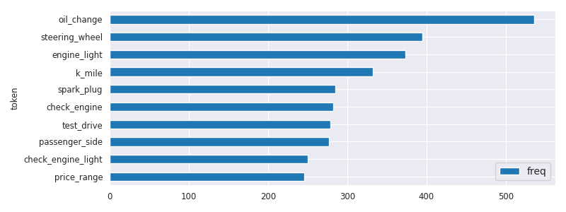

# Chapter 4: Data Preparation

## Data_Preparation.py
```shell
/home/cwm/git/git.c-w-m/nlp_dev/src/btap/.tox/btap38/bin/python /home/cwm/git/git.c-w-m/nlp_dev/src/btap/ch04/Data_Preparation.py
Chapter 04: Data Preparation
~~~~~~~~~~~~~~~~~~~~~~~~~~~~~~~~~~~~~~~~~~~~~~~~
setup.py
~~~~~~~~~~~~~~~~~~~~~~~~~~~~~~~~~~~~~~~~~~~~~~~~
Additional setup ...
$ 'python -m spacy download en_core_web_sm'
~~~~~~~~~~~~~~~~~~~~~~~~~~~~~~~~~~~~~~~~~~~~~~~~


~~~~~~~~~~~~~~~~~~~~~~~~~~~~~~~~~~~~~~~~~~~~~~~~
settings.py


~~~~~~~~~~~~~~~~~~~~~~~~~~~~~~~~~~~~~~~~~~~~~~~~
Loading Data into Pandas


~~~~~~~~~~~~~~~~~~~~~~~~~~~~~~~~~~~~~~~~~~~~~~~~
Blueprint: Standardizing Attribute Names
Index(['id', 'subreddit', 'title', 'selftext', 'category_1', 'category_2',
       'category_3', 'in_data', 'reason_for_exclusion'],
      dtype='object')
                                                                                                                                                                                                                                                                                                                                14356
id                                                                                                                                                                                                                                                                                                                             7jc2k4
subreddit                                                                                                                                                                                                                                                                                                                        volt
title                                                                                                                                                                                                                                                                                                           Dashcam for 2017 volt
text         Hello.<lb>I'm looking into getting a dashcam. <lb>Does anyone have any recommendations? <lb><lb>I'm generally looking for a rechargeable one so that I don't have to route wires down to the cigarette lighter. <lb>Unless there are instructions on how to wire it properly without wires showing. <lb><lb><lb>Thanks! 
category                                                                                                                                                                                                                                                                                                                        autos
subcategory                                                                                                                                                                                                                                                                                                                 chevrolet


~~~~~~~~~~~~~~~~~~~~~~~~~~~~~~~~~~~~~~~~~~~~~~~~
Saving and Loading a Data Frame


~~~~~~~~~~~~~~~~~~~~~~~~~~~~~~~~~~~~~~~~~~~~~~~~
Cleaning Text Data

After viewing the [PINKIEPOOL Trailer](https://www.youtu.be/watch?v=ieHRoHUg)
it got me thinking about the best match ups.
<lb>Here's my take:<lb><lb>[](/sp)[](/ppseesyou) Deadpool<lb>[](/sp)[](/ajsly)
Captain America<lb>


~~~~~~~~~~~~~~~~~~~~~~~~~~~~~~~~~~~~~~~~~~~~~~~~
Blueprint: Identify Noise with Regular Expressions
0.09009009009009009
100%|██████████| 20000/20000 [00:00<00:00, 106487.66it/s]
                                                                                                      text  \
19682  Looking at buying a 335i with 39k miles and 11 months left on the CPO warranty. I asked the deal...   
12357  I'm looking to lease an a4 premium plus automatic with the nav package.<lb><lb>Vehicle Price:<ta...   
2730   Breakdown below:<lb><lb>Elantra GT<lb><lb>2.0L 4-cylinder<lb><lb>6-speed Manual Transmission<lb>...   

       impurity  
19682      0.21  
12357      0.17  
2730       0.14  
100%|██████████| 20000/20000 [00:00<00:00, 131902.99it/s]
  0%|          | 0/20000 [00:00<?, ?it/s]         freq
token        
<lb>   100729
<tab>     642


~~~~~~~~~~~~~~~~~~~~~~~~~~~~~~~~~~~~~~~~~~~~~~~~
Blueprint: Noise Removal with Regular Expressions
After viewing the PINKIEPOOL Trailer it got me thinking about the best match ups. Here's my take: Deadpool Captain America
Impurity: 0.0
100%|██████████| 20000/20000 [00:03<00:00, 6420.50it/s]
                                                                                                                                                                                                    clean_text  \
14058  Mustang 2018, 2019, or 2020? Must Haves!! 1. Have a Credit score of 780\+ for the best low interest rates! 2. Join a Credit Union to finance the vehicle! 3. Or Find a Lender to finance the vehicle...   
18934  At the dealership, they offered an option for foot-well illumination, but I cannot find any reference to this online. Has anyone gotten it? How does it look? Anyone have pictures. Not sure if this...   
16505  I am looking at four Caymans, all are in a similar price range. The major differences are the miles, the years, and one isn’t a S. https://www.cargurus.com/Cars/inventorylisting/viewDetailsFilterV...   

       impurity  
14058      0.03  
18934      0.03  
16505      0.02  


~~~~~~~~~~~~~~~~~~~~~~~~~~~~~~~~~~~~~~~~~~~~~~~~
Blueprint: Character Normalization with textacy
"The cafe "Saint-Raphael" is located on Cote d'Azur.


~~~~~~~~~~~~~~~~~~~~~~~~~~~~~~~~~~~~~~~~~~~~~~~~
Blueprint: Pattern-based Data Masking with textacy
100%|██████████| 20000/20000 [00:01<00:00, 16038.46it/s]
  0%|          | 0/20000 [00:00<?, ?it/s]                                                                                              freq
token                                                                                             
www.getlowered.com                                                                               3
http://www.ecolamautomotive.com/#!2/kv7fq                                                        2
https://www.reddit.com/r/Jeep/comments/4ux232/just_ordered_an_android_head_unit_joying_jeep/     2
Check out _URL_
100%|██████████| 20000/20000 [00:05<00:00, 3469.20it/s]
100%|██████████| 20000/20000 [00:05<00:00, 3962.50it/s]


~~~~~~~~~~~~~~~~~~~~~~~~~~~~~~~~~~~~~~~~~~~~~~~~
Tokenization
~~~~~~~~~~~~~~~~~~~~~~~~~~~~~~~~~~~~~~~~~~~~~~~~
Blueprint: Tokenization with Regular Expressions
2019|08|10|23|32|pete|louis|don|have|well|designed|solution|for|today|problem|The|code|of|module|AC68|should|be|Have|to|think|bit|goodnight
2019-08-10|23:32|@pete|@louis|I|don't|have|a|well-designed|solution|for|today's|problem|The|code|of|module|AC68|should|be|-1|Have|to|think|a|bit|#goodnight|;-)|😩|😬


~~~~~~~~~~~~~~~~~~~~~~~~~~~~~~~~~~~~~~~~~~~~~~~~
Tokenization with NLTK
[nltk_data] Downloading package punkt to /home/cwm/nltk_data...
[nltk_data]   Package punkt is already up-to-date!
2019-08-10|23:32|:|@|pete/|@|louis|-|I|do|n't|have|a|well-designed|solution|for|today|'s|problem|.|The|code|of|module|AC68|should|be|-1|.|Have|to|think|a|bit|...|#|goodnight|;|-|)|😩😬
2019-08-10|23:32|@pete|@louis|I|don't|have|a|well-designed|solution|for|today's|problem|The|code|of|module|AC68|should|be|-1|Have|to|think|a|bit|#goodnight|;-)|😩|😬
2019-08-|10|23:32|:|@pete|/|@louis|-|I|don't|have|a|well-designed|solution|for|today's|problem|.|The|code|of|module|AC68|should|be|-|1|.|Have|to|think|a|bit|...|#goodnight|;-)|😩|😬
2019-08-10|23|:|32|:|@pete/@louis|-|I|don|'|t|have|a|well-designed|solution|for|today|'|s|problem.|The|code|of|module|AC68|should|be|-1.|Have|to|think|a|bit|...|#goodnight|;|-|)|😩😬


~~~~~~~~~~~~~~~~~~~~~~~~~~~~~~~~~~~~~~~~~~~~~~~~
Recommendations for Tokenization
Linguistic Processing with spaCy
Instantiating a Pipeline
[('tagger', <spacy.pipeline.pipes.Tagger object at 0x7f75011b0be0>), ('parser', <spacy.pipeline.pipes.DependencyParser object at 0x7f750d5d17c0>), ('ner', <spacy.pipeline.pipes.EntityRecognizer object at 0x7f750d5d1700>)]


~~~~~~~~~~~~~~~~~~~~~~~~~~~~~~~~~~~~~~~~~~~~~~~~
Processing Text
My|best|friend|Ryan|Peters|likes|fancy|adventure|games|.|        text     lemma_  is_stop  is_alpha   pos_      dep_ ent_type_ ent_iob_
0         My     -PRON-     True      True    DET      poss                  O
1       best       good    False      True    ADJ      amod                  O
2     friend     friend    False      True   NOUN     nsubj                  O
3       Ryan       Ryan    False      True  PROPN  compound    PERSON        B
4     Peters     Peters    False      True  PROPN     appos    PERSON        I
5      likes       like    False      True   VERB      ROOT                  O
6      fancy      fancy    False      True    ADJ      amod                  O
7  adventure  adventure    False      True   NOUN  compound                  O
8      games       game    False      True   NOUN      dobj                  O


~~~~~~~~~~~~~~~~~~~~~~~~~~~~~~~~~~~~~~~~~~~~~~~~
Blueprint: Customizing Tokenization
@Pete|:|choose|low|-|carb|#|food|#|eat|-|smart|.|_|url|_|;-)|😋|👍|

@Pete|:|choose|low-carb|#food|#eat-smart|.|_url_|;-)|😋|👍|


~~~~~~~~~~~~~~~~~~~~~~~~~~~~~~~~~~~~~~~~~~~~~~~~
Blueprint: Working with Stop Words
[Dear, Ryan, need, sit, talk, Regards, Pete]
Ryan|need|sit|down|talk|Pete|


~~~~~~~~~~~~~~~~~~~~~~~~~~~~~~~~~~~~~~~~~~~~~~~~
Blueprint: Extracting Lemmas based on Part-of-Speech
-PRON-|good|friend|Ryan|Peters|like|fancy|adventure|game|.
[friend, Ryan, Peters, adventure, games]
best|friend|fancy|adventure|games
good|friend|fancy|adventure|game


~~~~~~~~~~~~~~~~~~~~~~~~~~~~~~~~~~~~~~~~~~~~~~~~
Blueprint: Extracting Noun Phrases
good friend|fancy adventure|fancy adventure game
My best friend|Ryan Peters|fancy adventure games
good_friend|fancy_adventure|fancy_adventure_game|adventure_game


~~~~~~~~~~~~~~~~~~~~~~~~~~~~~~~~~~~~~~~~~~~~~~~~
Blueprint: Extracting Named Entities
(James O'Neill, PERSON) (World Cargo Inc, ORG) (San Francisco, GPE) ["James_O'Neill/PERSON", 'San_Francisco/GPE']


~~~~~~~~~~~~~~~~~~~~~~~~~~~~~~~~~~~~~~~~~~~~~~~~
Feature Extraction on a Large Dataset
Blueprint: One Function to Get It All
lemmas: ['good', 'friend', 'Ryan', 'Peters', 'like', 'fancy', 'adventure', 'game']
adjs_verbs: ['good', 'like', 'fancy']
nouns: ['friend', 'Ryan', 'Peters', 'adventure', 'game']
noun_phrases: ['adventure_game']
adj_noun_phrases: ['good_friend', 'fancy_adventure', 'fancy_adventure_game']
entities: ['Ryan_Peters/PERSON']
['lemmas', 'adjs_verbs', 'nouns', 'noun_phrases', 'adj_noun_phrases', 'entities']


~~~~~~~~~~~~~~~~~~~~~~~~~~~~~~~~~~~~~~~~~~~~~~~~
Blueprint: Using spaCy on a Large Data Set
No GPU found, working on CPU.
100%|██████████| 400/400 [09:46<00:00,  1.47s/it]
                                                                                                                                                                                                          text  \
12041  Esso touchless luxury car wash chemicals? Yes or a no no: (2016 981 Cayman GTS) I usually do two bucket hand wash, clay myself, and wax seal. But I always feel like **I can't wash the underbody en...   
15675  Want a BMW. Scared off by the maintenance tales.: I test drove a 2012 328i (52K miles) recently and fell in love. It was a fantastic drive and had all the features I'd ever want. Furthermore, the ...   
15185  Recently got my very first 3d printer, a MP Mini Delta. 3 days in and I think I've messed it up...: Ok so took a crash course on 3d printing when this arrived, but I had it printing in about 3 hou...   
4883   Noob question about tires and rims! Please help :): I bought a 14' wrangler sahara from the dealership used with a 2" lift and 22"rims on 35" tires. Is this going to grenade my drivetrain? (Flame ...   
7758   Lifetime warranty - worth it?: I just bought an '18 Civic EX (super pumped btw) and we were pushed to add on the additional warranty which covers electronics for as long as we own the vehicle. The...   

                                                                                                                                                                                                        lemmas  \
12041  [Esso, touchless, luxury, car, wash, chemical, yes, or, no, no, 2016, 981, Cayman, GTS, usually, do, two, bucket, hand, wash, clay, and, wax, seal, but, always, feel, like, can, wash, underbody, e...   
15675  [want, BMW, scare, off, by, maintenance, tale, test, drive, 2012, 328i, 52, k, mile, recently, and, fall, in, love, be, fantastic, drive, and, have, feature, 'd, ever, want, furthermore, cost, be,...   
15185  [recently, get, very, first, 3d, printer, MP, Mini, Delta, 3, day, in, and, think, have, mess, up, ok, so, take, crash, course, on, 3d, printing, when, arrive, but, have, print, in, about, 3, hour...   
4883   [Noob, question, about, tire, and, rim, please, help, buy, 14, wrangler, sahara, from, dealership, use, with, 2, lift, and, 22"rims, on, 35, tire, be, go, grenade, drivetrain, flame, want, but, ha...   
7758   [Lifetime, warranty, worth, just, buy, 18, civic, EX, super, pump, btw, and, be, push, add, on, additional, warranty, cover, electronic, for, as, long, as, own, vehicle, finance, guy, claim, that,...   

                                                                                                                                                                                                         nouns  \
12041  [Esso, luxury, car, wash, chemical, Cayman, GTS, bucket, hand, wash, wax, touch, wash, pressure, car, car, rock, grain, paint, luxury, wash, chemical, wax, chemical, chemical, people, car, cookie,...   
15675  [BMW, maintenance, tale, 328i, k, mile, love, drive, feature, cost, car, match, internet, tale, BWM, ownership, maintenance, cost, BMW, owner, issue, care, car, maintenance, cost, narrative, over-...   
15185  [printer, MP, Mini, Delta, day, crash, course, 3d, printing, hour, WiFi, QC, issue, price, point, day, fucker, stop, problem, build, plate, decal, sort, story, process, print, bit, sticker, metal,...   
4883                                                                    [Noob, question, tire, rim, wrangler, sahara, dealership, lift, tire, drivetrain, intention, snow, drift, field, look, gearing, thank]   
7758                                    [Lifetime, warranty, worth, EX, warranty, electronic, vehicle, finance, guy, customer, warranty, value, warranty, day, reliability, Honda, product, experience, input]   

                                                                                                                                                                                                  noun_phrases  \
12041         [luxury_car, luxury_car_wash, car_wash, luxury_car_wash_chemical, car_wash_chemical, wash_chemical, bucket_hand, bucket_hand_wash, hand_wash, luxury_wash, water_wash, pressure_wash, coin_wash]   
15675  [maintenance_tale, k_mile, maintenance_cost, maintenance_cost, maintenance_cost_narrative, cost_narrative, maintenance_cost_narrative_over-hyped, cost_narrative_over-hyped, narrative_over-hyped, s...   
15185                                                                                                                              [crash_course, 3d_printing, price_point, build_plate, grip_tape, grip_tape]   
4883                                                                                                                                                                                              [snow_drift]   
7758                                                                                                                                                                                             [finance_guy]   

                               entities  
12041  [Esso/PERSON, AutoDetailing/ORG]  
15675                [BMW/ORG, BMW/ORG]  
15185         [Mini_Delta/ORG, PLA/ORG]  
4883                      [Noob/PERSON]  
7758                        [Honda/ORG]  
100%|██████████| 20000/20000 [00:00<00:00, 213818.37it/s]


~~~~~~~~~~~~~~~~~~~~~~~~~~~~~~~~~~~~~~~~~~~~~~~~
Persisting the Result

ch04_fig01_token_freq_hbar.png
```


```shell

~~~~~~~~~~~~~~~~~~~~~~~~~~~~~~~~~~~~~~~~~~~~~~~~
A Note on Execution Time
There is More
Language Detection
Additional Blueprint (not in book): Language Detection with fastText
--2021-04-26 23:58:26--  https://dl.fbaipublicfiles.com/fasttext/supervised-models/lid.176.ftz
Resolving dl.fbaipublicfiles.com (dl.fbaipublicfiles.com)... 172.67.9.4, 104.22.75.142, 104.22.74.142, ...
Connecting to dl.fbaipublicfiles.com (dl.fbaipublicfiles.com)|172.67.9.4|:443... connected.
HTTP request sent, awaiting response... 200 OK
Length: 938013 (916K) [binary/octet-stream]
Saving to: ‘lid.176.ftz’

     0K .......... .......... .......... .......... ..........  5%  593K 1s
    50K .......... .......... .......... .......... .......... 10% 8.95M 1s
   100K .......... .......... .......... .......... .......... 16%  969K 1s
   150K .......... .......... .......... .......... .......... 21% 16.8M 1s
   200K .......... .......... .......... .......... .......... 27% 2.07M 0s
   250K .......... .......... .......... .......... .......... 32% 28.9M 0s
   300K .......... .......... .......... .......... .......... 38% 24.8M 0s
   350K .......... .......... .......... .......... .......... 43% 4.65M 0s
   400K .......... .......... .......... .......... .......... 49% 27.0M 0s
   450K .......... .......... .......... .......... .......... 54% 22.9M 0s
   500K .......... .......... .......... .......... .......... 60% 1.93M 0s
   550K .......... .......... .......... .......... .......... 65% 43.1M 0s
   600K .......... .......... .......... .......... .......... 70% 26.6M 0s
   650K .......... .......... .......... .......... .......... 76% 36.4M 0s
   700K .......... .......... .......... .......... .......... 81% 27.4M 0s
   750K .......... .......... .......... .......... .......... 87% 44.7M 0s
   800K .......... .......... .......... .......... .......... 92% 27.5M 0s
   850K .......... .......... .......... .......... .......... 98% 11.6M 0s
   900K .......... ......                                     100% 54.2M=0.2s

2021-04-26 23:58:27 (3.98 MB/s) - ‘lid.176.ftz’ saved [938013/938013]

Warning : `load_model` does not return WordVectorModel or SupervisedModel any more, but a `FastText` object which is very similar.
(('__label__en', '__label__de', '__label__te'), array([0.97039694, 0.00256404, 0.00231963]))
                                           text lang
0       I don't like version 2.0 of Chat4you 😡👎   en
1     Ich mag Version 2.0 von Chat4you nicht 😡👎   de
2        Мне не нравится версия 2.0 Chat4you 😡👎   ru
3        Não gosto da versão 2.0 do Chat4you 😡👎   pt
4  मुझे Chat4you का संस्करण 2.0 पसंद नहीं है 😡👎   hi
                                           text lang   lang_name
0       I don't like version 2.0 of Chat4you 😡👎   en     English
1     Ich mag Version 2.0 von Chat4you nicht 😡👎   de      German
2        Мне не нравится версия 2.0 Chat4you 😡👎   ru     Russian
3        Não gosto da versão 2.0 do Chat4you 😡👎   pt  Portuguese
4  मुझे Chat4you का संस्करण 2.0 पसंद नहीं है 😡👎   hi       Hindi


~~~~~~~~~~~~~~~~~~~~~~~~~~~~~~~~~~~~~~~~~~~~~~~~
Spell Checking
Token Normalization
Los_Angeles|is|a|city|in|the|United_States


~~~~~~~~~~~~~~~~~~~~~~~~~~~~~~~~~~~~~~~~~~~~~~~~

Process finished with exit code 0
```